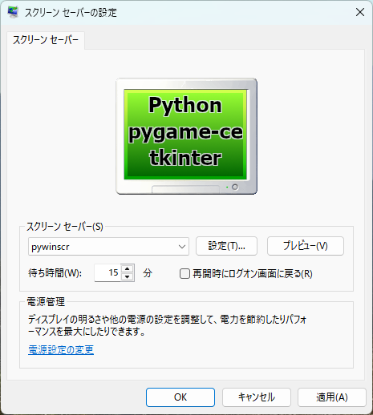
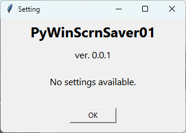

<!-- -*- encoding: utf-8 -*- -->

pywinscr
========

Pythonで作成したWindows用スクリーンセーバのサンプル。

Description / 説明
------------------

PythonでWindows用のスクリーンセーバを作成できるか試してみた。

* フルスクリーン表示は pygame-ce を使用。
* 設定画面表示は tkinter を使用。
* プレビューモードは pywin32 と Pillow を使用。
* exe化(scr化)は Nuitka を使用。

Screenshots
-----------





[全画面表示時の様子 screenshots_03_video.mp4](./screenshots/screenshots_03_video.mp4)

Requirement / 必要なもの
------------------------

* Python
* pygame-ce
* pywin32
* pillow
* Nuitka

Environment / 動作確認環境
--------------------------

* Windows11 x64 25H2
* Python 3.10.10 64bit
* pygame-ce 2.5.6
* pywin32 311
* pillow 12.1.0
* Nuitka 2.8.9
* ordered-set 4.1.0
* zstandard 0.25.0

Install / インストール方法
--------------------------

作成した実行バイナリ pywinscr.scr は64bit版のプログラムのはずなので以下にコピーする。

* `C:\Windows\System32\`

余談。スクリーンセーバが32bit版の場合は以下にコピーする。

* プログラムが32bit版で、OSが64bit版の場合、`C:\Windows\SysWOW64\` にコピー。
* プログラムが64bit版で、OSが64bit版の場合、`C:\Windows\System32\` にコピー。
* プログラムが32bit版で、OSが32bit版の場合、`C:\Windows\System32\` にコピー。

Note / 注記
-----------

* exeファイルの作成は mkexe.bat を実行する。Nuitka を利用する。
* scrファイルの作成は、exeファイルをリネームコピーして行う。mkscr.bat を実行する。
* venv で仮想環境を作ってから作業すれば取り込むモジュールの種類を最低限にできる。

```
python -m venv venv
venv\Scripts\activate
where python
python -m pip install pip -U
python -m pip install -r requirements.txt

mkexe.bat
mkscr.bat

deactivate
```

Author / 作者
-------------

[mieki256](https://github.com/mieki256)

